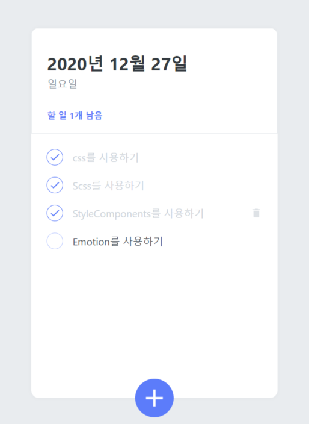
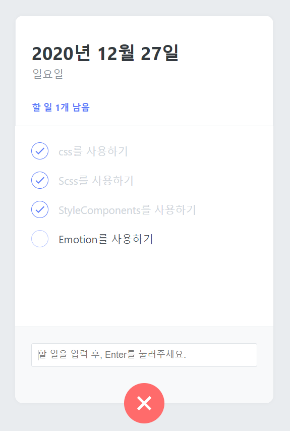

# TodoList - React + ContextApi + StyleComponents

# <기술스택>
## React , ContextApi , StyleComponents
 
•	작품소개 : React를 이용하여 TodoList를 개발하였습니다.  
            함수형컴포넌트 Hook의 useReducer와 상태관리 라이브러리 ContextApi로 상태관리를 하고   
            StyleComponents를 이용해 스타일을 입혀서 개발하였습니다.  
 
### [웹페이지 바로가기](https://wondonghwi.github.io/React_TodoList_styleComponents_Context/)

( Preview )  
할일 목록 View (:hover시 Delete 버튼 나타남) 

할일 목록 추가 화면 

